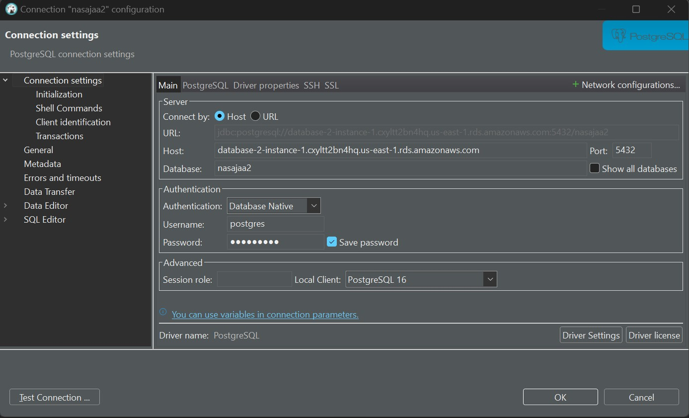

Go to Modules -> then: Launch AWS Academy Learner Lab -> Start Lab -> click on aws with green light

## Step 1: Create S3 bucket

1. **Create bucket**:
    - Search for S3 bucket and click `create bucket` -> `solarflaredata`
    - Bucket name: Enter a unique name for your bucket. Bucket names must be globally unique across all AWS users.
    - Region: Select the AWS Region where you want this bucket to reside. It's often best to choose the region closest to you or your users.
    - ACLs disabled
    - Bucket Versioning: Enable
    - Bucket Key: Enable

> **_NOTE:_** choose Linux 2 it's the most stable version

## Step 2: Set Up an AWS Cloud9 Environment
1. **Open the AWS Cloud9 Console** simply search for it
2. **Create a new environment**: Click on "Create environment".
3. **Name your environment** I chose default settings and access environment through ssh.
4. **press create**
5. **Wait for the environment to be created** look at the top loading part and then open the IDE.

### Install Required Libraries and Create a Deployment Package
1. **Open a new terminal** in the AWS Cloud9 environment you can see it in the lower part.
2. **Create a directory** for your Lambda Layer and navigate into it:

```sh
mkdir nasa-python-layer
cd nasa-python-layer
```

3. **Create a Python virtual environment** and activate it:

```sh
python3 -m venv nasapython
source nasapython/bin/activate
```

4. **Install the libraries** needed by your Lambda function:

```sh
pip install requests pandas
```

5. **Deactivate the virtual environment** after the installations are complete:

```sh
deactivate
```

6. **Move the libraries to a folder structure** expected by Lambda Layers:

```sh
cd nasapython/lib/python3.9/site-packages
zip -r9 /home/ec2-user/environment/nasa-python-layer/layer.zip .
```

**This method didn't work so I am doing it this way**

```sh
# Install/build python3.9 in the Cloud9 Linux session.

# PHASE 1:

cd /opt
sudo wget https://www.python.org/ftp/python/3.9.6/Python-3.9.6.tgz
sudo tar xzf Python-3.9.6.tgz
cd Python-3.9.6
sudo ./configure --enable-optimizations
sudo make altinstall
sudo rm -f /opt/Python-3.9.6.tgz

# Return to home directory
cd ~/

# Install virtualenv
python3 -m pip install --user virtualenv

# PHASE 2: Create a virtual environment in python 3.9 and add the needed libraries/packages

mkdir folder
cd folder
virtualenv v-env --python=python3.9
source ./v-env/bin/activate
pip install pandas
pip install numpy
pip install tweepy
pip install requests
pip install psycopg2-binary
deactivate

# PHASE 3: Ship all the libraries/packages into the AWS lambda service

mkdir python
cd python
cp -r ../v-env/lib/python3.9/site-packages/* .
cd ..
zip -r my_custom_layer.zip python

# save to s3 bucket
aws s3 cp my_custom_layer.zip s3://databaseenv/

aws lambda publish-layer-version --layer-name my_custom_lambda_layer --zip-file fileb://my_custom_layer.zip --compatible-runtimes python3.9

```

Download the layer.zip from cloud9 (you can see it in the sidebar)
I downloaded the zipfile and added it to an s3 bucket and from there linked it to a layer


## Step 3: Create the Lambda Layer
1. **Go to the Lambda Console** 
2. **Choose "Layers"** in the sidebar and then click "Create layer".
3. **Upload the ZIP file** created in Cloud9:
   - Name the layer.
   - Choose "Upload a .zip file" and upload the `layer.zip` from Cloud9.
   - Select the compatible runtime for the Lambda function (python 3.9 and x86_64).
4. **Click "Create"**

### Add the Layer to Lambda Function
1. **Go to Lambda function**
2. **Choose "Add a layer"** -> end of the page -> and select the layer created.
3. **Select Custom layers** -> chose the layer created and the version -> and click "Add".

### Clean Up the Cloud9 Environment
After that and for budget reasons it's no longer necessary to keep the Cloud9 environment, so delete it:
1. **Go back to the Cloud9 Console**.
2. **Select the environment** you want to delete.
3. **Click "Delete"** and follow the prompts to confirm the deletion.


### Setting Up the Data Source with AWS Lambda

1. **Create an AWS Lambda Function**:
   - Go to the AWS Lambda console in AWS Academy Learner Lab (found iy in search).
   - Click on “Create function” orange button 
   - Choose “Author from scratch”, enter a function name, select a Python runtime (Python 3.9 - recommended by lecturer and according to the environment created above).
   - Choose the instruction set architecture -> type of computer processor that Lambda uses to run the function.
   - Under Permissions, choose or create an execution role that has permissions to access S3, AWS Glue, and CloudWatch Logs. -> By default, Lambda will create an execution role with permissions to upload logs to Amazon CloudWatch Logs. You can customize this default role later when adding triggers.
    For my task, the role needs permissions to:
        Access the S3 bucket (read/write).
        (Optional) Access AWS Secrets Manager if you are storing your API keys there.
        Log to Amazon CloudWatch for monitoring and logging purposes.
    
    

    Not allowed to do this so I ended up with Labrole (not the one in the picture)

    

    - in advanced settings:
        Enable Tags: Recommended for better resource management. (did't end up doing it)

2. **Add Trigger**:
   - click on add trigger
   - Set up an Amazon EventBridge (CloudWatch Events) trigger to run my function every 3 days:
    - Go to Amazon EventBridge and create a new rule:
        - Define a schedule using a cron expression (`cron(0 0 */7 * ? *)` for every 7 days at midnight UTC).
            https://docs.aws.amazon.com/eventbridge/latest/userguide/eb-create-rule-schedule.html 
            `0 0 */7 * ? *`
            The first two "0"s indicate that the function will run at the 0th minute of the 0th hour.
            "*/7": Run every three days.
            The remaining fields (* ? *) specify that the function will run every day of the month, every month, and every day of the week.
            
            

        - click add

3. **Implement Data Retrieval in Lambda**:
   - Store API Key in environment variables:
    In the Lambda function `configuration`, under the `Environment variables`, add a new variable:
        Key: API_KEY
        Value: Your actual NASA API key
        
   
   - Store S3 bucket name in environment variables

   > **_NOTE:_** add the name of the bucket and key without quotation marks
   
   - Code:

    ```python
        import requests
        import json
        import pandas as pd
        from datetime import datetime, timedelta
        import logging
        import boto3
        import os

        # Initialize S3 client
        s3 = boto3.client('s3')

        # Setup logger
        logging.basicConfig(level=logging.INFO)
        logger = logging.getLogger()

        def lambda_handler(event, context):
            api_key = os.environ['API_KEY']
            bucket_name = os.environ['BUCKET_NAME']

            end_date = datetime.now()
            start_date = end_date - timedelta(days=30)
            start_date_str = start_date.strftime('%Y-%m-%d')
            end_date_str = end_date.strftime('%Y-%m-%d')

            solar_flare_url = f'https://api.nasa.gov/DONKI/FLR?startDate={start_date_str}&endDate={end_date_str}&api_key={api_key}'
            
            try:
                response = requests.get(solar_flare_url)
                response.raise_for_status()  # Raises an HTTPError for bad responses
                data = response.json()
                
                # Process and save data
                if data:
                    normalized_data = pd.json_normalize(data)
                    file_name = f"solar_data_{start_date_str}_to_{end_date_str}.csv"
                    file_path = f"/tmp/{file_name}"
                    normalized_data.to_csv(file_path, index=False)
                    
                    # Upload to S3
                    s3.upload_file(file_path, 'solarflaredata', file_name)
                    logger.info(f"Data saved to S3 successfully, number of entries: {len(data)}")
                else:
                    logger.info("No data available for the given date range.")
                    
                return {
                    'statusCode': 200,
                    'body': json.dumps('Data processing and saving successful!')
                }

            except requests.exceptions.RequestException as e:
                logger.error(f"Request failed: {e}")
                return {
                    'statusCode': 500,
                    'body': json.dumps('Data processing failed!')
                }
    ```

In AWS Lambda, event and context are two parameters passed to the handler function:

- **event** - This parameter is used to pass in event data to the handler. This data is usually of the JSON format and it contains information about the event that triggered the Lambda function. For instance, if the trigger is set up via Amazon EventBridge (CloudWatch Events), the event object will contain details about the triggering event. If triggered by an API Gateway event, it would contain details about the HTTP request.

- **context** - This parameter provides methods and properties that provide information about the invocation, function, and execution environment. The context object contains information such as the function's CloudWatch log group, the request ID, the time remaining before AWS Lambda terminates the function (timeout), etc.

### Step 6: Deploy and Test Lambda Function
Make sure it executes correctly.

## Step 4: create an aurora postgred sql database

1. got to RDS dashboard (searched for it)
2. click create database 
3. select Aurora (PostgreSQL Compatible)
4. select the default version
5. public access -> yes
6. get the lowest memory and no monitoring otherwise there will be an error creating the database.

7. download and install PostgreSQL installer https://www.postgresql.org/download/windows/
8. Add PostgreSQL to the System PATH:
    Open the Control Panel.
    Go to System and Security -> System -> Advanced system settings
    Click on the "Environment Variables" button.
    In the "System variables" section, find the Path variable and click "Edit".
    Add the path to the PostgreSQL bin directory (e.g., C:\Program Files\PostgreSQL\16\bin).
    open git bash and type `psql --version`
9. find Endpoint: in the RDS Dashboard -> "Databases" section and select the Aurora PostgreSQL cluster. Copy the "Endpoint" (e.g., my-aurora-cluster.cluster-xxxxxx.us-west-2.rds.amazonaws.com)
10. connect to the database `psql -h my-aurora-cluster.cluster-xxxxxx.us-west-2.rds.amazonaws.com -U master_username -d postgres`

From 7-10 didn't work

so I connected to dbeaver and from there connected to th aws database 
here is the connection details:



### Create the tables 

```SQL
    CREATE TABLE mars_weather (
        primary_key SERIAL PRIMARY KEY,
        id INT NOT NULL,
        terrestrial_date TIMESTAMP,
        sol INT,
        ls INT,
        month VARCHAR(255),
        min_temp FLOAT,
        max_temp FLOAT,
        pressure FLOAT,
        atmo_opacity VARCHAR(255)
    );

    CREATE TABLE solar_flare_data (
        id SERIAL PRIMARY KEY,
        flrID VARCHAR(255),
        instruments VARCHAR(255),
        beginTime TIMESTAMP,
        peakTime TIMESTAMP,
        endTime TIMESTAMP,
        classType VARCHAR(255),
        sourceLocation VARCHAR(255),
        activeRegionNum FLOAT,
        note TEXT,
        linkedEvents TEXT,
        submissionTime VARCHAR(255),
        link VARCHAR(255),
        intensity VARCHAR(255)
    );

    CREATE TABLE weather_data (
        id SERIAL PRIMARY KEY,
        date TIMESTAMP,
        latitude FLOAT,
        longitude FLOAT,
        temperature_2m FLOAT,
        relative_humidity_2m FLOAT,
        rain FLOAT,
        direct_radiation_instant FLOAT,
        location VARCHAR(255)
    );
```

## Step 5: move the data to the tables

Move all the data to one S3 bucket in order to move it to a database.

check the script data_transfer.py

## Step 7 perform data analysis and forecasting

check out the notebook streamlit_prep.ipynb

## Step 6 connect a streamlit app to the database

and create visualizations
