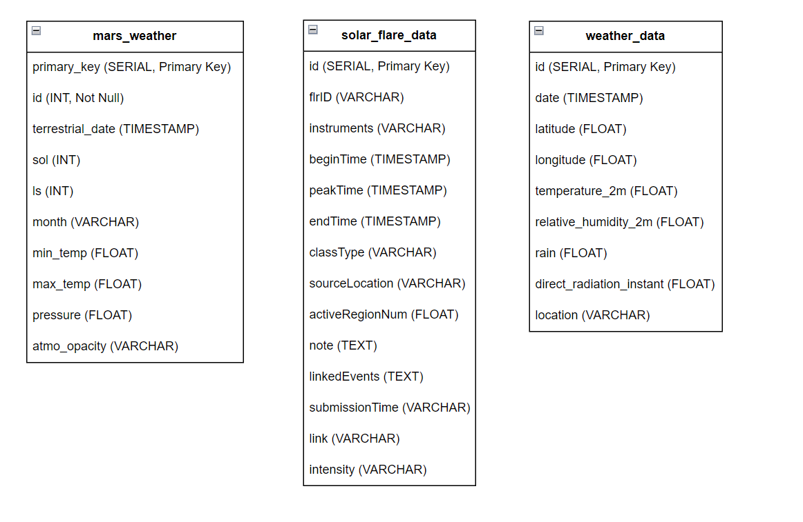

# Comparing Skies: Cross-Planetary Weather Analysis


This project aims to compare atmospheric patterns on Earth and Mars, leveraging vast datasets from both planets to understand climate trends and interactions. The insights gained could help in predicting Earth's future climate scenarios and evaluating Mars as a potential habitat for human colonization.

## Authors
 - [Albin Plathottathil](https://github.com/albinpla)
 - [Ansam Zedan](https://github.com/ansamz)
 - [Joana Duarte](https://github.com/JDFDuarte)


#### -- Project Status: [Finished]

## Project Structure

```plaintext
/
├── .streamlit/            # Streamlit configurations
├── AZ_aws_code_docs       # Ansam's documentation and journal
├── aws/                   # aws code and DB queries
├── data/                  # Data downloaded
├── img/                   # Images for the report, screenshots of aws functions
├── Mars_data_notebook/                   
├── NASA_API_notebooks/                   
├── open_meteo_notebooks/
├── proposal/       
├── streamlit_app/         # Streamlit app code and notebooks for visualizations before integrating into the app
└── requirements.txt       # requirements file to install all the libraries required for the project
```

## Technologies Used
- **AWS Services**: S3, Lambda, Cloud9, Aurora PostgreSQL
- **APIs**: NASA Mars Weather Service API, Meteo Weather API, NOAA National Weather Service API, Kaggle
- **Python Libraries**: Pandas, Requests, Numpy, Tweepy, Psycopg2-binary, boto3
- **Tools**: AWS Academy Learner Lab, Git, DBeaver, Streamlit

## Setup and Installation

### AWS Setup
1. **Create an AWS S3 bucket** to store the weather data.
2. **Set up an AWS Cloud9 environment** for developing and deploying AWS Lambda functions.
3. **Configure AWS Lambda** to retrieve and process data from the Mars Weather API and Earth weather APIs, storing the results in S3.
4. **Deploy a PostgreSQL database on AWS Aurora** to manage and query the data.
5. **Link the AWS Lambda functions to the Aurora database** to populate it with processed data.

### Local Environment
Ensure Python 3.9+ is installed and then set up a virtual environment:
```bash
python3 -m venv env
source env/bin/activate
pip install -r requirements.txt
```

Or using anaconda
```bash
conda create --name NASA python">=3.9"
conda activate NASA
conda install pip
pip install -r requirements.txt
```

## Data Collection
Scripts to pull data from the APIs are located in the `Mars_data_notebook/`, `NASA_API_notebooks/`, `open_meteo_notebooks/` folders. These should be scheduled to run at regular intervals using AWS Lambda.

There are also sample data downloaded in the `data/` folder.

## Database Schema



## Visualization
A Streamlit app is used to visualize the data. To run the app locally:
```bash
streamlit run streamlit_app\Home.py
```
